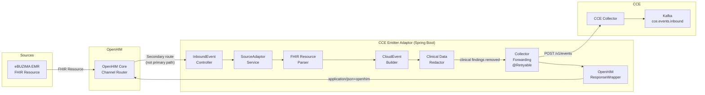
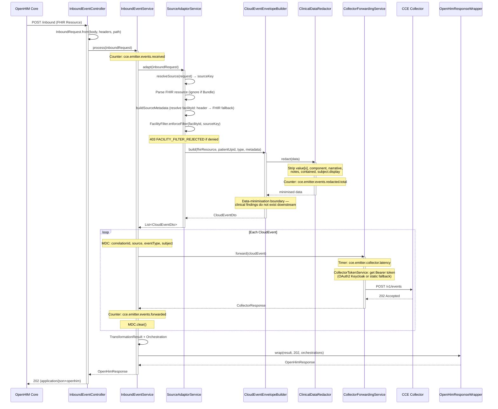
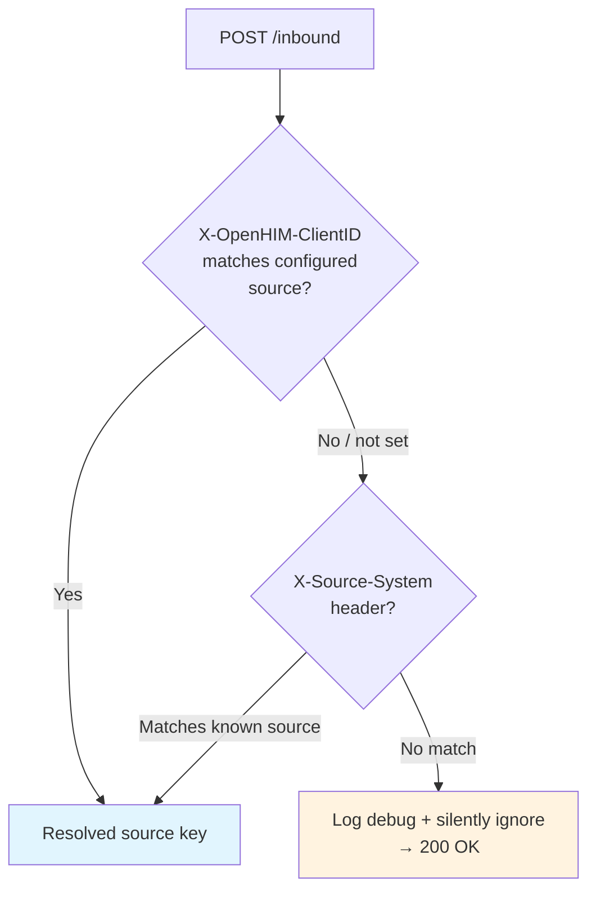
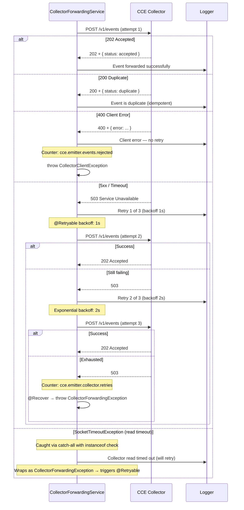
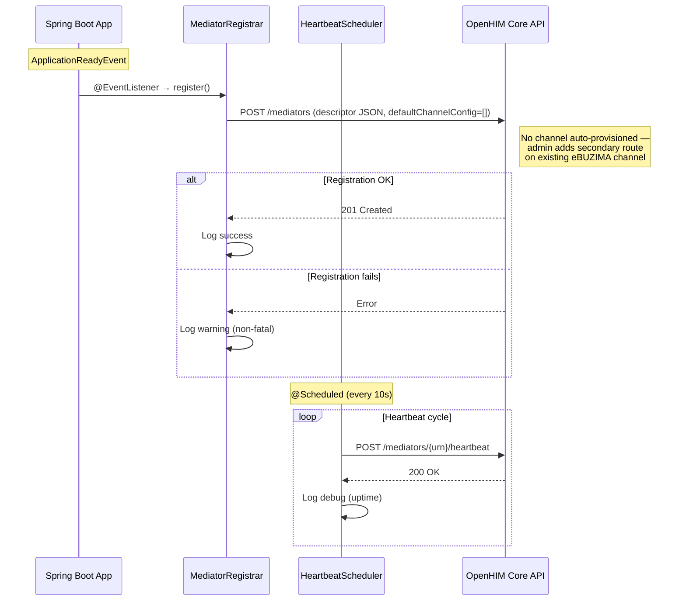
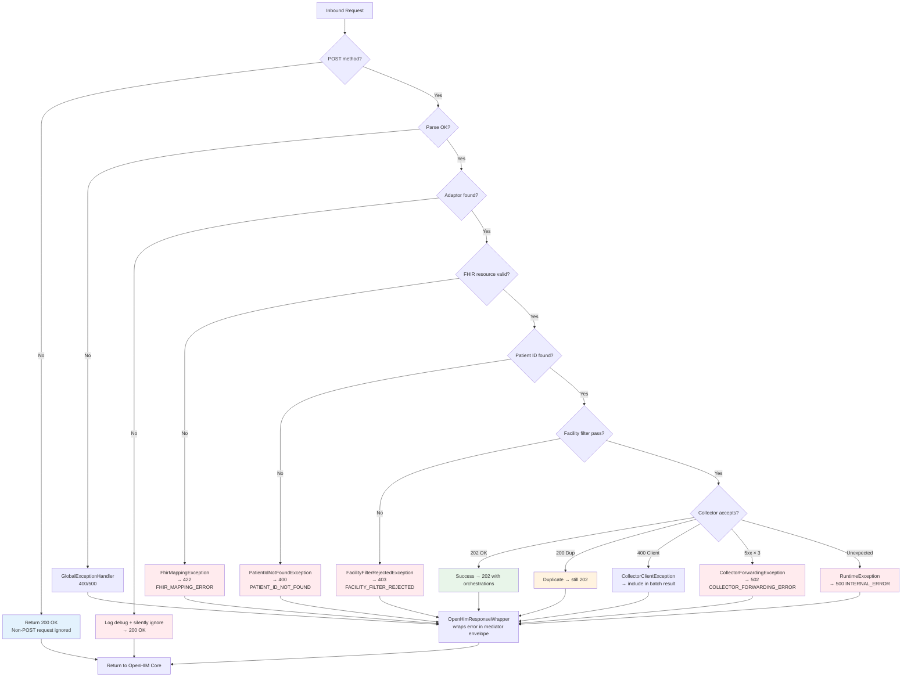
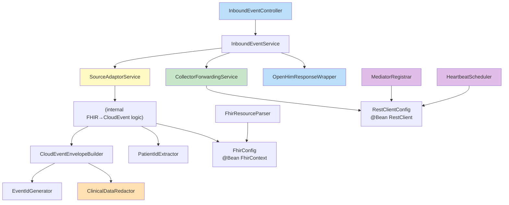
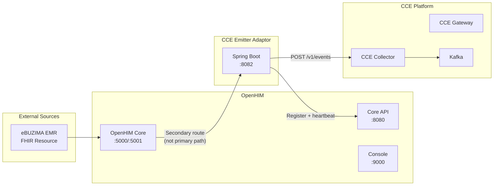

# CCE Emitter Adaptor — Flow Diagrams

All diagrams use Mermaid notation.

## 1. End-to-End Event Flow

## 2. Request Processing Sequence

## 3. Adaptor Selection Flow

## 4. Collector Forwarding with Retry

## 5. OpenHIM Registration & Heartbeat Lifecycle

## 6. Error Handling Flow

## 7. Component Dependency Graph

## 8. Deployment Topology

